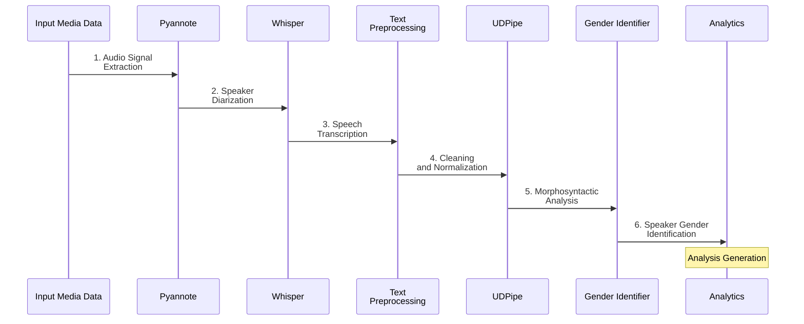
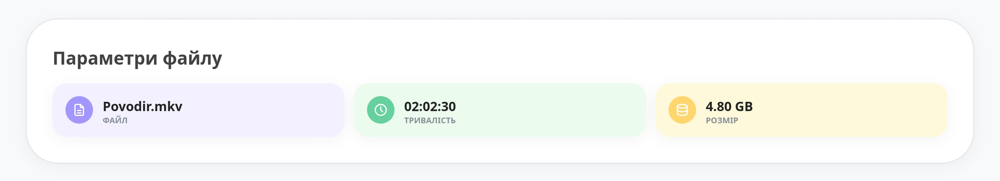
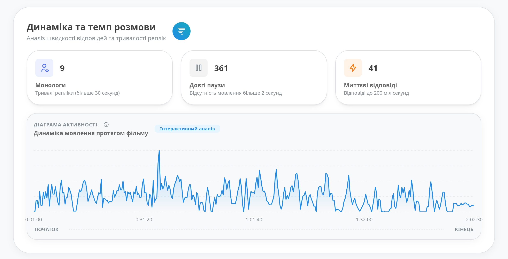
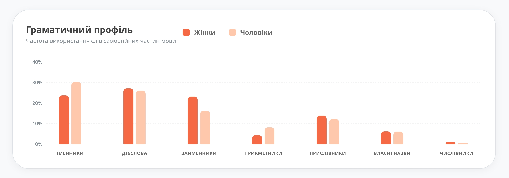
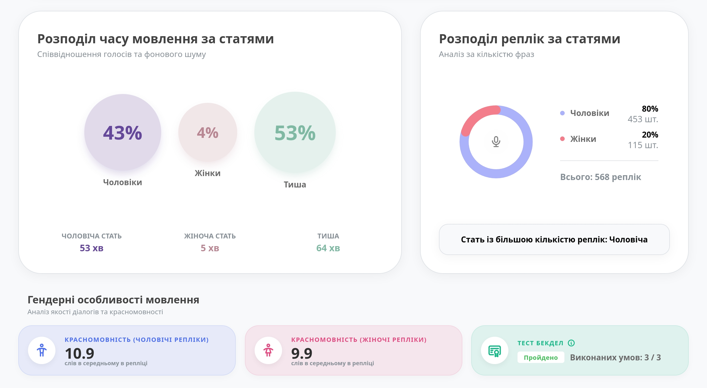
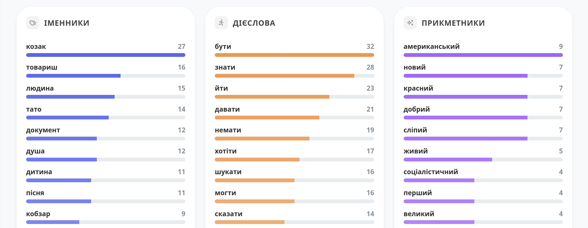
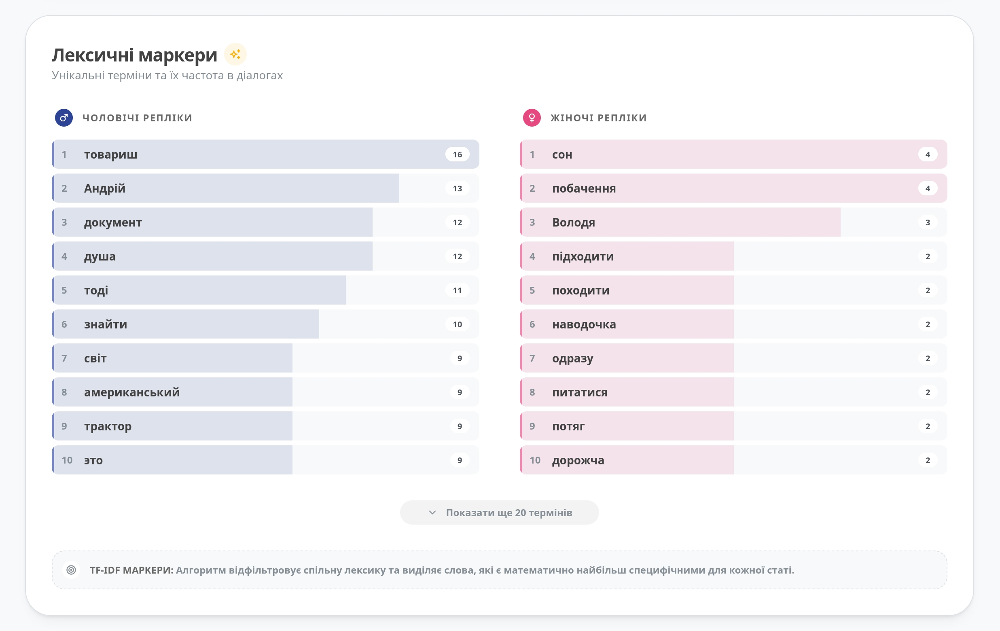

# 🎬 NLP-Based Analysis of Dialogues in Ukrainian Films

An end-to-end Natural Language Processing (NLP) pipeline designed to extract, analyze, and map sociolinguistic and narrative trends for a given movie. 

This system leverages multimodal data fusion (Text, Audio, Vision) to automate media analysis, tracking gender representation, dialogue dynamics, and lexical markers.

* **Academic Credentials:** This project was developed as a Bachelor’s Diploma Thesis at the **National University of Kyiv-Mohyla Academy (NaUKMA)**.
* **Academic Peer Review:** Validated and presented at the *III (IX) International Scientific and Practical Conference "Information Technologies: Theory and Practice" (March 25–27, 2026)*.

---

## The Core Problem

Traditional media analytics and sociolinguistic research suffer from three major challenges:
1. **High Resource Consumption:** Manual analysis of large video corpus requires immense human hours.
2. **Subjectivity Bias:** Human annotators bring personal biases, risking inconsistent analytical results.
3. **Tool Fragmentation:** A lack of unified digital platforms capable of handling everything from raw speech-to-text to deep linguistic pattern mining.

Additionally, this project also applies **Computational Social Science (CSS)** principles by providing key insights on the movie corpus.

---

## Data Pipeline Architecture

The system processes incoming multimedia file through a sequential engineering pipeline:

### Core Data Pipeline Stages

* **Audio Extraction & Diarization:** Isolates audio channels and employs `pyannote.audio` to segment dialogue boundaries per distinct speaker character.
* **Automated Speech Recognition (ASR):** Utilizes `Whisper` model to transcribe segmented dialogue segments.
* **Text Cleaning and Normalization:** Standardizes raw transcript text, stripping pipeline-induced lexical artifacts.
* **Linguistic Parsing:** Uses `UDPipe` for advanced morphosyntactic tokenization and grammatical dependency mapping.
* **Gender Identification:** Multimodal approach to detect speaker gender.
* **Analysis:** Generating analytics profile for given movie.

---

### Key Technical Innovations

#### 1. Ukrainian-Specific Rule Engine for Gender Mining
Due to the highly inflected nature of the Ukrainian language, gender markers are structurally embedded within predicate forms (e.g., past-tense verbs and nominal attributes). The pipeline implements a specialized method that maps:
* **First-Person/Second-Person Contexts:** Analyzes syntax configurations between subject pronouns (*"Я"*, *"Ти"*) and matching predicates.
* **Example:** In the sentence *"Я пішов"*, the engine maps the past-tense verb morphology to instantly resolve a male speaker identity.

#### 2. Tri-Modal Data Fusion
Instead of relying strictly on text, the system uses a robust multimodal architecture to determine speaker characteristics:
* **Text:** Rule-based morphology parsing coupled with Machine Learning tool.
* **Audio:** Evaluates acoustic vocal frequencies using gender classification model.
* **Vision:** Employs computer vision tracking models.

> The models compensate for each other's limitations. For example, acoustic data remains perfectly functional under low lighting conditions where computer vision models degrade.

---

### 📈 Analytics

Once processed, the program builds a comprehensive multi-dimensional analytical profile:
* **Temporal Profiling:** Calculates speaking time distribution across genders, conversational velocity, and monologue instances.
* **Dialogue Balance Metrics:** Measures overall replica counts, average phrase length ("Eloquence" rating).
* **Lexical Mapping:** Extracts parts-of-speech distributions and distinct TF-IDF vocabulary for each gender.
* **Sociolinguistic Evaluation:** Features an automated **Bechdel Test** verifier (detects if at least two female characters talk to each other about a topic other than a man).

---

### Corpus Testing & Key Findings

The system was tested and validated on a comprehensive sample of **135 Ukrainian films** spanning from **1952 to 2025**. Key data insights uncovered include:

* **Dialogue Distribution:** Heavy masculine dominance was observed in traditional narrative structures, reaching as high as 80% conversational control in selected top-20 films.
* **Directorial Influence:** Data profiles revealed that female directors show a significantly narrower, more unified variance in character average replica length across all personas. Conversely, male directors exhibit broader, more volatile phrase extremes.
* **Lexical Stereotyping:** Aggressive, action-oriented verbs (*"атакувати"*, *"вдарити"*) appeared multiple times more frequently within male dialogue profiles. Meanwhile, domestic and high-emotion terms (*"зварити"*, *"прибирати"*) heavily saturated female character speech.

---

### 🖥️ User Interface Preview

  
📸 Click to expand web application screenshots

   
  
  <h4>Main Dashboard Overview</h4>

  <h4>Movie Pace Analysis</h4>

  <h4>Pard Of Speech Usage Per Gender</h4>

  <h4>Replicas Stats Per Gender, Bechdel Test</h4>

  <h4>Top Nouns, Verbs, Adjectives used in Movie</h4>

  <h4>TF-IDF Markers per Gender</h4>

